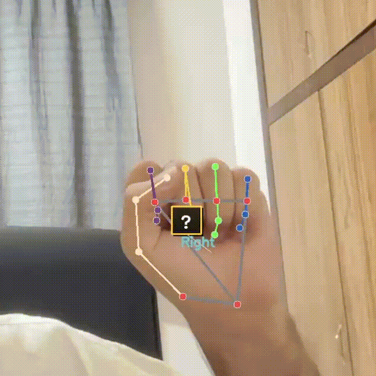

# ✋ AirSketch

> **Transform your hands into digital brushes** - An AI-powered computer vision application that turns hand gestures into interactive drawing and gesture recognition experiences.


## 🎯 Feature Demo

| 🎨 Air Drawing | 🤖 Gesture Recognition |
|:-------------:|:---------------------:|
|  |  |
| Draw with hand gestures | Real-time gesture detection |

## 📺 Video Tutorial

<div align="center">
  <a href="https://youtu.be/uzM4oFQPDSo?si=4UzegIuCdZJ0oa4z">
    
  </a>
  <p><em>🚀 Complete walkthrough of AirSketch - from setup to creating your own dataset and training a new model!</em></p>
</div>

**What you'll learn:**
- 🛠️ Project setup and installation
- 🎯 Understanding the codebase structure
- 🎨 How to use all drawing and detection modes
- 🧠 Training your own gesture models

## 🎨 What is AirSketch?

AirSketch is a revolutionary computer vision application that bridges the gap between physical gestures and digital interaction. Using advanced machine learning models and real-time hand tracking, it transforms your webcam into a powerful tool for:

- **✏️ Air Drawing** - Draw in mid-air using hand gestures
- **🤖 Gesture Recognition** - Train and recognize custom hand gestures
- **📊 Dataset Creation** - Build your own gesture datasets with ease
- **🎥 Recording & Analysis** - Capture and analyze your interactions

## 🚀 Features

### 🎯 Multiple Operation Modes

| Mode | Description | Key |
|------|-------------|-----|
| **Landmark** | Basic hand tracking with joint visualization | `E` |
| **Detection** | Custom gesture recognition and classification | `Q` |
| **Drawing** | Air drawing with pen/eraser gestures | `W` |
| **Dataset** | Interactive dataset creation for training | `D` |

### 🎨 Drawing Capabilities
- **Pen Mode**: Draw smooth green lines in the air
- **Eraser Mode**: Remove drawings with finger gestures
- **Canvas Management**: Clear, save, and manipulate your artwork
- **Real-time Feedback**: Visual indicators for active tools

### 🧠 AI-Powered Recognition
- **TensorFlow Lite Models**: Optimized for real-time performance
- **Anomaly Detection**: Autoencoder-based gesture validation
- **Custom Training**: Build models for your specific gestures
- **Confidence Scoring**: Reliability metrics for predictions

### 📊 Dataset Creation Tools
- **Manual Mode**: Capture specific gesture samples on-demand
- **Automatic Mode**: Continuous data collection for training
- **Label Management**: Interactive labeling system
- **CSV Export**: Ready-to-use datasets for machine learning

## 🛠️ Installation

### Prerequisites
- Python 3.8 or higher
- Webcam or camera device
- 4GB+ RAM recommended

### Quick Setup

```bash
# Clone the repository
git clone https://github.com/yourusername/AirSketch.git
cd AirSketch

# Install dependencies
pip install -r requirements.txt

# Run the application
python main_app.py
```

### Dependencies
- **OpenCV**: Computer vision and image processing
- **MediaPipe**: Hand landmark detection
- **TensorFlow**: Machine learning models
- **NumPy/Pandas**: Data manipulation
- **Scikit-learn**: Model utilities

## 🎮 Usage Guide

### Getting Started
1. **Launch**: Run `python main_app.py`
2. **Camera Setup**: Ensure your webcam is connected
3. **Hand Position**: Place your hand in front of the camera
4. **Mode Selection**: Use keyboard shortcuts to switch modes

### Keyboard Controls

```
🎯 Mode Switching
E - Landmark Mode (hand tracking only)
Q - Detection Mode (gesture recognition)
W - Drawing Mode (air drawing)
D - Dataset Mode (data collection)

🎨 Drawing Controls
C - Clear canvas
SPACE - Capture gesture (dataset mode)

📹 Recording
R - Start/Stop video recording

🔧 Dataset Tools
M - Toggle manual capture mode
L - Change label (manual mode)

⚡ General
ESC - Exit application
```

### Drawing Mode Tutorial
1. Press `W` to enter drawing mode
2. Make a **"pen"** gesture to start drawing
3. Make an **"eraser"** gesture to erase
4. Use `C` to clear the entire canvas

### Creating Custom Gestures
1. Press `D` to enter dataset mode
2. Enter a label for your gesture
3. Press `SPACE` to start/stop data collection
4. Perform your gesture repeatedly
5. Train your model using the Jupyter notebooks

## 📁 Project Structure

```
AirSketch/
├── 🎯 Core Application
│   ├── main_app.py              # Main application entry point
│   ├── gesture_predictor.py     # Gesture recognition engine
│   ├── drawing_handler.py       # Air drawing functionality
│   ├── dataset_creator.py       # Dataset collection tools
│   ├── ui_handler.py           # User interface components
│   └── utils.py                # Utility functions
│
├── 🧠 AI Models
│   ├── models/                 # Trained models
│   │   ├── tflite/            # Optimized TensorFlow Lite models
│   │   ├── gesture_classifier.h5
│   │   └── autoencoder.keras
│   └── drawing_models/        # Drawing-specific models
│
├── 📊 Data & Training
│   ├── data/                  # Generated datasets
│   ├── notebooks/             # Jupyter training notebooks
│   │   ├── neural_network.ipynb
│   │   ├── auto_encoder.ipynb
│   │   └── data-exploration.ipynb
│   └── recordings/            # Video recordings
│
└── 📋 Configuration
    ├── requirements.txt       # Python dependencies
    └── README.md             # This file
```

## 🧪 Model Training

AirSketch includes comprehensive Jupyter notebooks for training your own models:

### 1. Data Exploration (`data-exploration.ipynb`)
- Analyze collected gesture data
- Visualize hand landmark patterns
- Identify data quality issues

### 2. Neural Network Training (`neural_network.ipynb`)
- Train gesture classification models
- Hyperparameter optimization
- Performance evaluation

### 3. Autoencoder Training (`auto_encoder.ipynb`)
- Build anomaly detection models
- Threshold optimization
- Gesture validation

## 🎯 Advanced Features

### Real-time Performance
- **High FPS**: Optimized for smooth real-time interaction
- **TensorFlow Lite**: Mobile-optimized model inference

### Gesture Validation
- **Autoencoder Filtering**: Reject invalid or unknown gestures
- **Confidence Thresholding**: Adjustable prediction confidence
- **Anomaly Detection**: Identify out-of-distribution inputs

### Data Collection
- **Smart Sampling**: Automatic frame interval optimization
- **Label Validation**: Interactive confirmation system

## 🤝 Contributing

We welcome contributions! Here's how you can help:

1. **🐛 Bug Reports**: Found an issue? Open a GitHub issue
2. **💡 Feature Requests**: Have an idea? We'd love to hear it
3. **🔧 Code Contributions**: Fork, develop, and submit a PR
4. **📚 Documentation**: Help improve our docs and tutorials

### Development Setup
```bash
# Fork and clone your fork
git clone https://github.com/yourusername/AirSketch.git

# Create a feature branch
git checkout -b feature/amazing-feature

# Make your changes and commit
git commit -m "Add amazing feature"

# Push and create a PR
git push origin feature/amazing-feature
```

## 🔧 Troubleshooting

### Common Issues

**Camera not detected**
```bash
# Check available cameras
python -c "import cv2; print([i for i in range(10) if cv2.VideoCapture(i).read()[0]])"
```

**Model loading errors**
- Ensure all model files are in the correct directories
- Check TensorFlow installation: `pip install tensorflow==2.19.1`

## 📄 License

This project is licensed under the MIT License - see the [LICENSE](LICENSE) file for details.

## 🙏 Acknowledgments

- **MediaPipe Team** - For excellent hand tracking capabilities
- **TensorFlow Team** - For powerful ML framework
- **OpenCV Community** - For computer vision tools

## 🌟 Star History

If you find AirSketch useful, please consider giving it a star! ⭐

---

**Made with ❤️ by Hassan Kalantari**

*Transform your gestures into digital magic* ✨